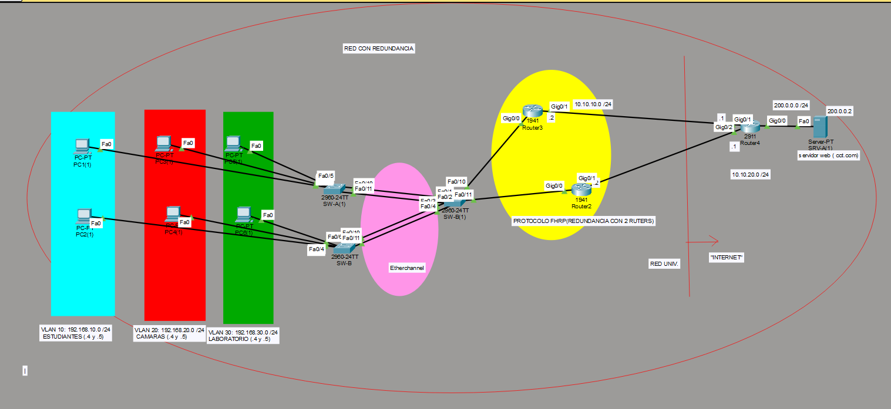

# 🌐 Red LAN con Alta Disponibilidad
## Comparativa de una infraestructura con y sin redundancia usando HSRP, EtherChannel y OSPF



---

## 📖 Descripción del Proyecto

Este proyecto presenta el diseño, implementación y análisis de una **red LAN universitaria con y sin mecanismos de redundancia**, desarrollada en **Cisco Packet Tracer**.

Se comparan dos infraestructuras:

- 🔴 **Red sin redundancia:** presenta puntos únicos de falla.
- 🟢 **Red con alta disponibilidad:** incorpora redundancia en enlaces y gateways mediante **EtherChannel y HSRP**.

El objetivo principal fue evaluar cómo responde la infraestructura ante fallas controladas, midiendo el **tiempo de recuperación de la conectividad** y analizando el impacto de cada mecanismo de redundancia.

El proyecto fue presentado en la **Feria de Proyectos UNITEC 2026-2**.

---

## 🎯 Objetivos

### Objetivo principal

Diseñar, implementar y comparar una red LAN universitaria con y sin redundancia para analizar su comportamiento ante fallas de conectividad.

### Objetivos específicos

- Diseñar una topología sin redundancia y otra con redundancia.
- Segmentar la red mediante VLANs.
- Configurar enlaces trunk entre switches y routers.
- Implementar **EtherChannel con LACP**.
- Implementar **HSRP/FHRP** para redundancia de gateway.
- Utilizar **OSPF** para enrutamiento dinámico.
- Simular fallas controladas.
- Medir el tiempo de recuperación de la red.

---

## 🗺️ Topología de la Red

La infraestructura fue diseñada para comparar dos escenarios:

### 🔴 Red sin redundancia

La red utiliza un único camino de comunicación.

Una falla en un enlace o dispositivo crítico puede provocar la pérdida completa del servicio, debido a que no existe un mecanismo alternativo que permita mantener la conectividad.

### 🟢 Red con redundancia

La infraestructura redundante incorpora:

- Dos switches de acceso.
- Dos enlaces físicos agrupados mediante **EtherChannel**.
- Dos routers trabajando con **HSRP**.
- Tres VLANs.
- Enlaces trunk.
- Enrutamiento dinámico mediante **OSPF**.
- Router de salida hacia la red del servidor.

---

## 🏗️ Estructura de la Red

### 1. Segmentación mediante VLANs

| VLAN | Grupo | Red | PCs | Gateway Virtual |
|---|---|---|---|---|
| 10 | Estudiantes | `192.168.10.0/24` | `.4` y `.5` | `192.168.10.1` |
| 20 | Cámaras | `192.168.20.0/24` | `.4` y `.5` | `192.168.20.1` |
| 30 | Laboratorio | `192.168.30.0/24` | `.4` y `.5` | `192.168.30.1` |

Cada VLAN utiliza una dirección IP virtual proporcionada mediante **HSRP** como gateway por defecto.

---

## ⚙️ Tecnologías Implementadas

### 🔗 EtherChannel + LACP

Se agruparon dos enlaces físicos entre los switches **SW-A y SW-B** para que funcionaran como una única interfaz lógica `Port-Channel`.

Esto permite:

- Agregación de enlaces.
- Mayor disponibilidad.
- Continuidad del tráfico ante la pérdida de uno de los enlaces físicos.

Configuración utilizada:

```bash
interface range FastEthernet0/10-11
 channel-group 1 mode active

interface Port-channel1
 switchport mode trunk
```

El modo `active` permite establecer el EtherChannel mediante **LACP**.

---

### 🔁 HSRP / FHRP

Se configuraron dos routers para compartir una misma dirección IP virtual utilizada como gateway por los hosts.

Uno de los routers actúa como **Active** y el otro permanece como **Standby**.

Distribución de roles:

- **Router 3:** Active para VLAN 10 y VLAN 20.
- **Router 2:** Active para VLAN 30.

Ejemplo de configuración:

```bash
interface GigabitEthernet0/0.10
 encapsulation dot1Q 10
 ip address 192.168.10.2 255.255.255.0

 standby 10 ip 192.168.10.1
 standby 10 priority 110
 standby 10 preempt
```

Cuando el router activo deja de responder, el router en estado Standby asume el rol de gateway.

---

### 🛰️ OSPF

Se utilizó **OSPF** para proporcionar conectividad dinámica entre los routers internos y el router de salida.

Red del servidor:

```text
200.0.0.0/24
```

Servidor utilizado para las pruebas:

```text
200.0.0.2
```

El tráfico ICMP hacia este servidor permitió comprobar la continuidad del servicio durante las pruebas de falla.

---

## 🧪 Metodología de Pruebas

Para evaluar el comportamiento de la infraestructura se realizaron fallas controladas.

### Procedimiento

1. Ejecutar un `ping` continuo desde una PC hacia `200.0.0.2`.
2. Verificar que la conectividad funcionara correctamente.
3. Provocar intencionalmente una falla.
4. Registrar la pérdida de paquetes.
5. Medir el tiempo necesario para recuperar la conectividad.
6. Repetir las pruebas para comparar los resultados.

---

## 📊 Resultados Experimentales

En total se realizaron **21 pruebas controladas**:

- 🔴 **1 prueba** sobre la red sin redundancia.
- 🟡 **10 pruebas** de failover con HSRP.
- 🟢 **10 pruebas** de falla de enlace con EtherChannel.

### Resumen de resultados

| Escenario | Pruebas | Resultado |
|---|---:|---|
| Red sin redundancia | 1 | No se recupera automáticamente |
| HSRP | 10 | ~12 segundos |
| EtherChannel | 10 | 0 segundos de corte perceptible |

---

## 🔁 Resultado de HSRP

Durante las pruebas de failover se registraron tiempos cercanos a los **12 segundos**.

Valores observados:

| Prueba | Tiempo de recuperación |
|---|---:|
| HSRP - Router 1 | `12.304 s` |
| HSRP - Router 2 | `12.266 s` |

Cuando el router activo dejó de responder, el router Standby detectó la falla y asumió automáticamente el rol de gateway.

✅ **Resultado:** recuperación automática de la conectividad sin intervención manual.

---

## ⚡ Resultado de EtherChannel

Durante las pruebas se desconectó uno de los enlaces físicos pertenecientes al EtherChannel.

El enlace restante continuó transportando tráfico.

```text
Tiempo de interrupción perceptible: 0 s
```

✅ **Resultado:** no se observó una interrupción perceptible de conectividad durante la falla evaluada.

---

## 📈 Comparación de Disponibilidad

| Característica | Sin Redundancia | HSRP | EtherChannel |
|---|---|---|---|
| Recuperación automática | ❌ | ✅ | ✅ |
| Redundancia de gateway | ❌ | ✅ | — |
| Redundancia de enlace | ❌ | — | ✅ |
| Intervención manual | Sí | No | No |
| Interrupción observada | Permanente | ~12 s | No perceptible |

> 💡 **Nota técnica:** HSRP y EtherChannel no cumplen la misma función.
>
> **HSRP** proporciona redundancia del gateway, mientras que **EtherChannel** proporciona redundancia y agregación de enlaces.
>
> Ambos mecanismos son complementarios dentro de una arquitectura de alta disponibilidad.

---

## 🧠 ¿Qué Aprendimos?

Las pruebas mostraron que una infraestructura sin redundancia puede quedar completamente fuera de servicio cuando falla un único componente crítico.

La incorporación de mecanismos de redundancia permite reducir este riesgo:

```text
Mayor Redundancia
       ↓
Mayor Disponibilidad
       ↓
Mayor Continuidad del Servicio
```

---

## ✅ Conclusiones

### 1. Una red sin redundancia presenta puntos únicos de falla

La caída de un enlace o equipo crítico puede provocar la pérdida total de conectividad.

### 2. HSRP mejora la disponibilidad del gateway

El router Standby puede asumir automáticamente el rol del router Active cuando este deja de responder.

En las pruebas realizadas, el tiempo de recuperación fue de aproximadamente **12 segundos**.

### 3. EtherChannel mejora la tolerancia ante fallas de enlace

La pérdida de uno de los enlaces físicos no produjo una interrupción perceptible durante las pruebas realizadas.

### 4. La redundancia mejora la continuidad del servicio

La combinación de redundancia de gateway y redundancia de enlaces reduce el impacto de fallas individuales.

### 5. Mayor disponibilidad implica mayor complejidad

La implementación de mecanismos como HSRP y EtherChannel requiere configuración adicional, pero permite construir infraestructuras más tolerantes a fallos.

---

## 🛠️ Tecnologías Utilizadas

- Cisco Packet Tracer
- VLAN
- IEEE 802.1Q
- EtherChannel
- LACP
- HSRP / FHRP
- OSPF
- ICMP
- IPv4

---

## 📁 Archivos del Repositorio

```text
.
├── README.md
├── image.png
├── red redundancia cct.pkt
└── presentacion-red-lan-alta-disponibilidad-unitec-2026-2.pdf
```

### 📦 Archivo de simulación

`red redundancia cct.pkt`

Archivo principal del laboratorio desarrollado en **Cisco Packet Tracer**.

Permite revisar la topología, configuraciones y reproducir las pruebas de falla.

### 🖼️ Topología

`image.png`

Imagen de la infraestructura utilizada durante el proyecto.

### 📄 Presentación

[Ver presentación del proyecto](presentacion-red-lan-alta-disponibilidad-unitec-2026-2.pdf)

Incluye:

- Objetivos.
- Mecanismos de redundancia.
- Metodología.
- Resultados experimentales.
- Comparación de tiempos.
- Conclusiones.

---

## 👥 Integrantes

- **Jhonel Mahel Esteban Vera**
- Angela Antonella Silva Vasquez
- Alisson Dayana Cabrera Zegarra
- Adriel Caleb Quispe Chacchi
- Josué Joel Rojas Ninaco

---

## 🎓 Evento

**Feria de Proyectos UNITEC 2026-2**

Proyecto orientado al análisis experimental de mecanismos de alta disponibilidad en redes LAN.

---

## 👨‍💻 Autor

**Jhonel Mahel Esteban Vera**  
Estudiante de Ingeniería de Telecomunicaciones  
Universidad Nacional de Ingeniería — FIEE
